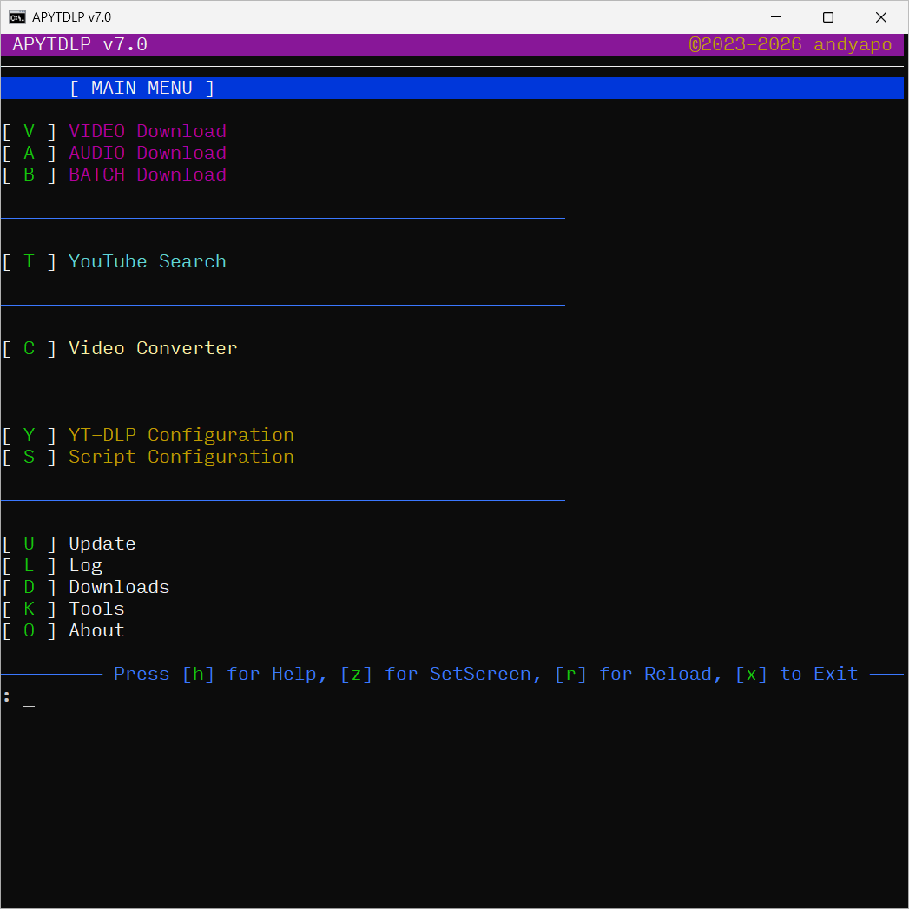
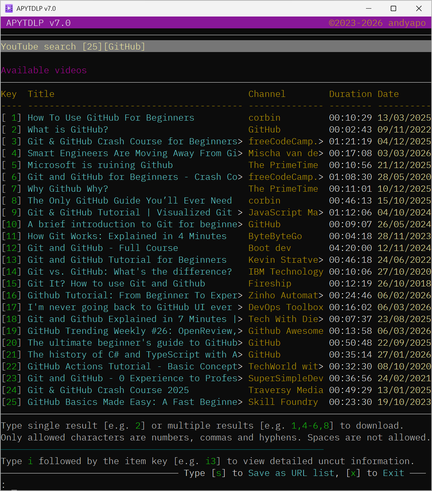
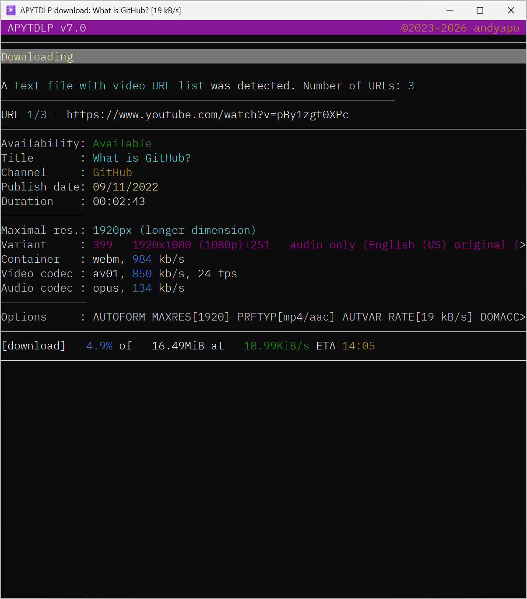
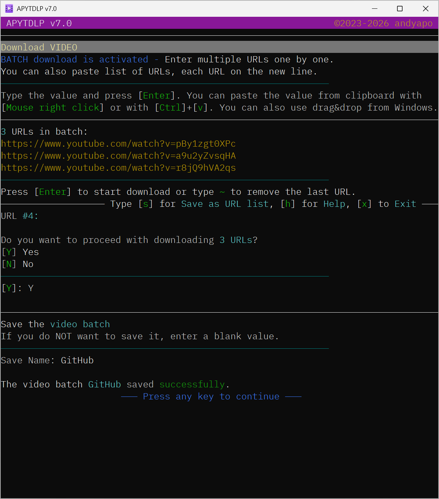
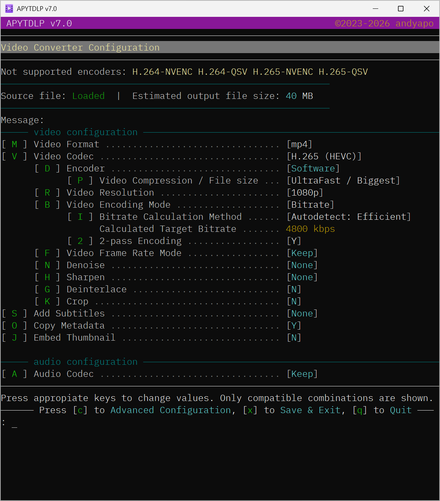
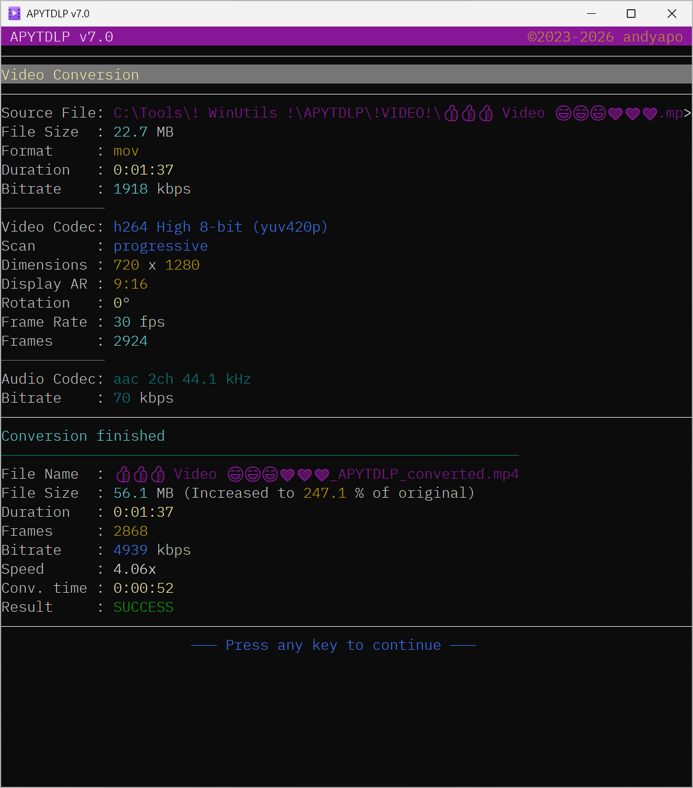

# APYTDLP


**Interactive yt-dlp & FFmpeg terminal frontend for Windows**

<p align="center">

</p>

APYTDLP is a highly configurable, keyboard-driven Batch application that provides
an interactive terminal interface for:

- **yt-dlp** – downloading videos and audio
- **FFmpeg** – converting and processing media

The project is designed for power users who prefer **keyboard workflows,
fine-grained control and transparent configuration** rather than graphical frontends.

🔥 The project is actively developed.

---

## Features

### Downloading
- Video and audio downloads powered by **yt-dlp**
- Multiple simultaneous download windows
- Built-in **YouTube search**
- URL list loading, saving and management

### Converting
- Video conversion powered by **FFmpeg**
- Software and hardware encoder support
- Flexible bitrate / quality configuration

### Environment management
- Automatic download and update of required tools
- Self-contained runtime environment
- Single-instance execution protection

### Customization
- yt-dlp and FFmpeg configuration via menus
- Script theming and console customization
- Persistent configuration with backup system
- Logging and history tracking
- Optional PowerShell integration

---

## Screenshots

### YouTube search
<p align="center">

</p>

Built-in search allows browsing YouTube results directly inside the terminal.

---

### Video download
<p align="center">

</p>

Detailed video metadata, format selection and real-time download progress.

---

### Batch downloads
<p align="center">

</p>

Download multiple URLs at once and optionally store them as reusable URL lists.

---

### Video converter configuration
<p align="center">

</p>

Fine-grained control over encoding, bitrate, filters and processing options.

---

### Conversion results
<p align="center">

</p>

Conversion summary including encoding speed, bitrate and resulting file size.

---

## Requirements

- Windows **10 or newer**
- Internet connection

Optional:
- PowerShell (for some advanced features)

---

## Third-party tools used by the script
- [](https://github.com/yt-dlp/yt-dlp)<br>
- [](https://www.7-zip.org)<br>
- [](https://www.ffmpeg.org)<br>
- [](https://github.com/denoland/deno)<br>

All required third-party tools in the newest versions are automatically downloaded by the script.

---

## Installation

1. [](https://github.com/andyapo/APYTDLP/releases/latest/download/APYTDLP.cmd) the latest release from:<br>
**https://github.com/andyapo/APYTDLP/releases/latest/download/APYTDLP.cmd**
2. Place the script into any directory
3. Double click the file **APYTDLP.cmd** or run it from Command Prompt. If Windows SmartScreen message appears, choose “More info” → “Run anyway”
4. First run may take longer due to 3rd party tool checks and downloads

---

## Notes
- This release is intended for **Windows 10 and newer**
- Configuration and user data are stored per-user in `%APPDATA%`
- What started as a small, simple script two and a half years ago gradually evolved over time.
  As more features were added, I decided to share the project in its current state.
  This is a hobby project, so it may contain bugs or lack certain features.
  Constructive feedback and suggestions for improvement are very welcome.


---

## Security Notice

APYTDLP is distributed as plain Batch source code.<br>
It's an independent project and is not affiliated with or endorsed by the yt-dlp authors.

- You are encouraged to **review the script** before running.
- Only releases from the **official repository** should be trusted.
- Modified versions are **not supported** by the author.
- The author is **not responsible** for any issues caused by unofficial versions.
- This script is unsigned; for code-signing verification see the repository instructions.

---

### Integrity Check

☝️To ensure the file has not been tampered with, verify its size and SHA-256 checksum.<br>
**Size:**<br>
620 372 bytes<br>
**SHA-256**:<br>
b5c0737931b0ad4cc8483d7c661cdf058e962e2af296b04bc6ed1e1a5d48be10<br>

To verify SHA-256, please run:<br>
**Command Prompt**:<br>
```bat
certutil -hashfile APYTDLP.cmd SHA256
```

**PowerShell**:<br>
```powershell
Get-FileHash .\APYTDLP.cmd -Algorithm SHA256
```

⚠️ If the checksum does not match, do not run the file and download the latest version directly from this repository.

---

## License

MIT License
© 2023–2026 andyapo
